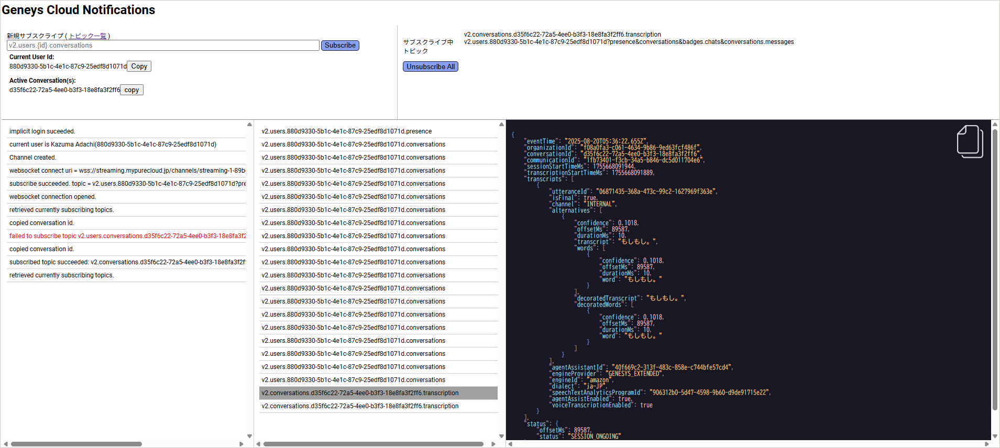

# Genesys Cloud Demo
# Notifications API Tester (Implicit Grant & Authorization Code Grant with PKCE)

To test Genesys Notifications APIs, you can use the official Genesys tool called "Developer Toolbox". However, it often requires multiple copy and paste actions. This tool allows you to test Notifications APIs easily in a single-page application.  
Please make sure to add your application URL to the Redirect URL list in your Genesys Cloud OAuth client settings.

**Initial implementation: February 2025*

