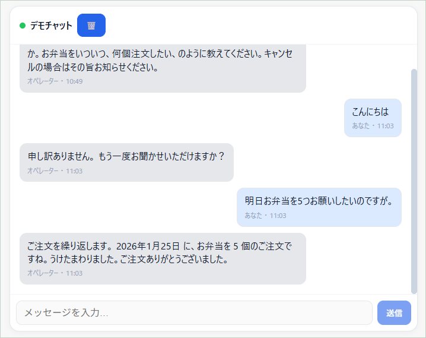

# Genesys Cloud Demo
## Web Messenger Custom User Interface ( Headless Mode )

This is a sample code for implementing a custom user interface for Genesys Cloud Web Messenger.  
Please make sure that you set "headlessMode" to true in your messenger settings.

**Initial implementation: November 2025*

You can see the demonstrations [here](https://gsolar.kazumadachi.com/tools/genesys_web_messenger_custom_ui.html).
